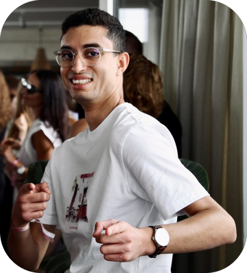

<h3 align="center">
  Yoo! I am Aaron  
</h3>

Remember that kid who turned the classroom into a tech lab? That's me!  Same energy, bigger playground: I'm now a full-stack engineer in Berlin who likes owning things end-to-end.

At [@root-global](https://github.com/root-global), I'm one of the early engineers behind the carbon calculator that 49 enterprise food & beverage companies use to measure and cut farm-level emissions. I live mostly in the backend, and contributed an agentic development setup with Cursor initially and now Claude, adopted by 7–8 engineers.

Before Berlin, I experimented internally with fine-tuning LLaMA-3 at Save Your Wardrobe to enable booking aftercare services with natural language, a process I built with the team there, where we empowered some of the biggest and most prestigious fashion brands like Loro Piana to enhance their customer relationships and increase the lifespan of their garments; I taught Python to 60+ students, co-founded a software studio as CTO, and won Google's prize at the Orange Summer Challenge 2022 with my team (no big deal, just saying :p).

### 🔭 Currently
I like going the extra mile, mostly because that's where the fun stuff happens. That's also why I love contributing to open source.
- Cooking up **Finch** 🤫, an AI side project in fintech. More soon
- Contributing to Apple's [MLX](https://github.com/ml-explore/mlx)
- Learning German (langsam aber sicher)

### 🏁 Off the keyboard
When I'm not shipping code, you'll find me at the gym, out on a run, or on a tennis court; showing up consistently is my thing, on and off the keyboard. The rest of the time, I'm watching Formula One, driving loud, unapologetic engines as fast as I can (or as fast as I dare, haha), whether on the Nürburgring or the Autobahn, or on a dance floor. Yes, I'm a bachata-dancing software engineer, and I'm always up for a dance-off (or a code-off, for that matter).

### ✍️ Latest article
Writing articles is one of my secret passions. Here's my latest on [Medium](https://aaronhaddad.medium.com):

### 💬 Let's talk

